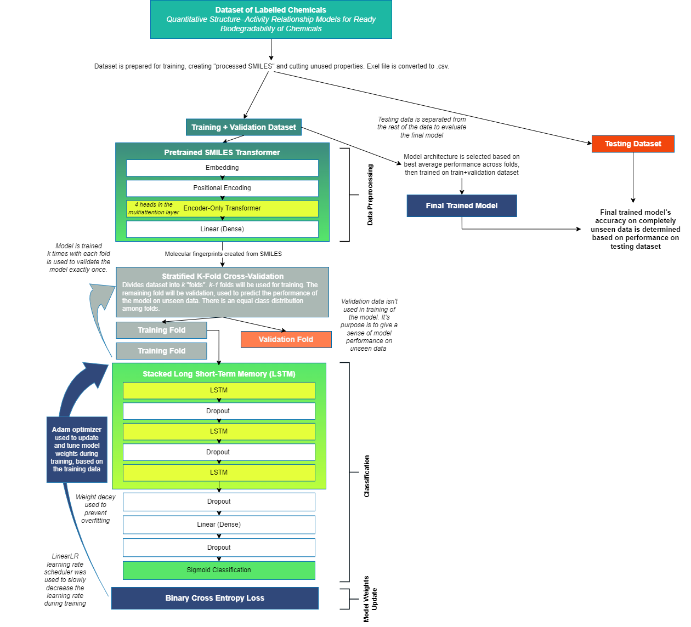

# A NATURAL LANGUAGE PROCESSING APPROACH TO READY BIODEGRADABLE CHEMICAL CLASSIFICATION

Presently, QSAR models created for biodegradation requires additional molecular descriptors on top of SMILES (chemical structural data) for classification. This project aims to, using Natural Language Processing architecture, create a binary classification model that uses only SMILES to predict the Ready Biodegradation of a chemical.

## MODEL ARCHITECTURE
The basic structure of the model, as well as the process of model training and testing, can be described as below:

This model consists of:
<ul>
<li>Mansouri et al.'s QSAR biodegradation dataset, used to train the model
<li>Honda et al's SMILES Transformer, to create molecular fingerprints
<li>Three stacked LSTM layers
<li>One linear layer
<li>A final sigmoid classification function
</ul>

### What does what
Just explain what the model does here exactly

## NAVIGATING THE PROJECT
### Data
**/Data** contains all the files used throughout model creation. These include Excel datasets (.xlsx files), formatted data (.csv files), necessary files for the SMILES Transformer (.txt, .pkl).

**/Models** contains saved model weights. 

### Graphs
**/Graphs** and **RNNGraphs** both contain graphs of different training runs. **/Graphs** graphs are specifically from the LSTM version of the model. **/RNNGraphs** are from the RNN version of the model. 

Graphs are generated and overwritten every run.

